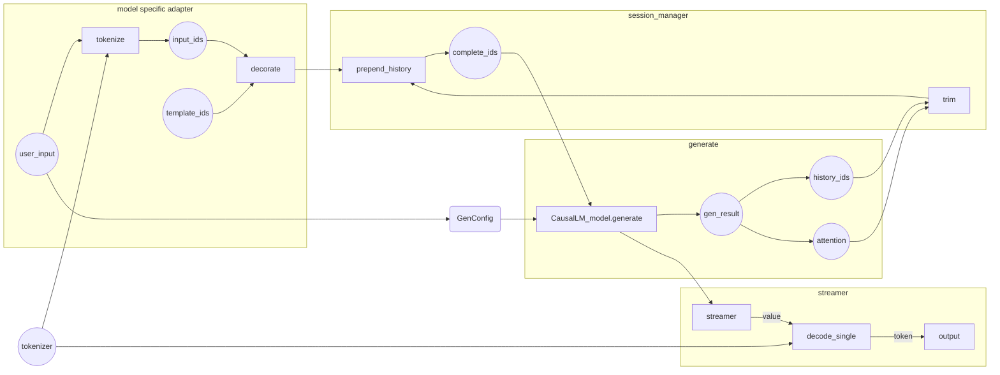

# Pytorch

## Chat in command line

LMDeploy support chatting with PyTorch models with submodule `lmdeploy.pytorch.chat`.

This submodule allow user to chat with language model through command line, and optionally accelerate model using backends like deepspeed.

**Example 1**: Chat with default setting

```shell
python -m lmdeploy.pytorch.chat $PATH_TO_HF_MODEL
```

**Example 2**: Disable sampling and chat history

```shell
python -m lmdeploy.pytorch.chat \
    $PATH_TO_LLAMA_MODEL_IN_HF_FORMAT \
    --temperature 0 --max-history 0
```

**Example 3**: Accelerate with deepspeed inference

```shell
python -m lmdeploy.pytorch.chat \
    $PATH_TO_LLAMA_MODEL_IN_HF_FORMAT \
    --accel deepspeed
```

Note: to use deepspeed, you need to install deepspeed, and if hope to accelerate InternLM, you need a customized version <https://github.com/wangruohui/DeepSpeed/tree/support_internlm_0.10.0>

**Example 4**: Tensor parallel the model on 2 GPUs

```shell
deepspeed --module --num_gpus 2 lmdeploy.pytorch.chat \
    $PATH_TO_LLAMA_MODEL_IN_HF_FORMAT \
    --accel deepspeed \
```

This module also allow the following control commands to change generation behaviors during chat.

- `exit`: terminate and exit chat
- `config set key=value`: change generation config `key` to `value`, e.g. config temperature=0 disable sampling for following chats
- `clear`: clear chat history

### Simple diagram of components


