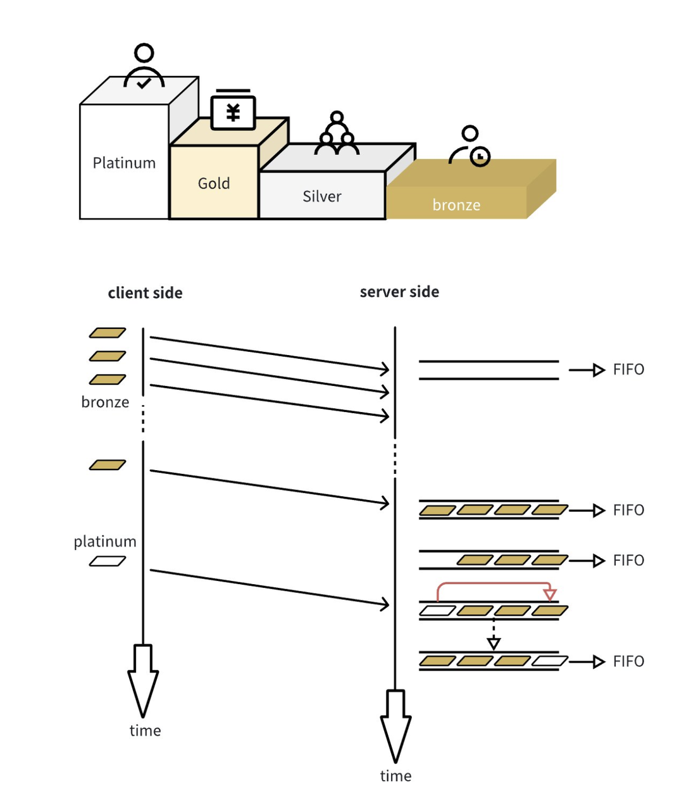
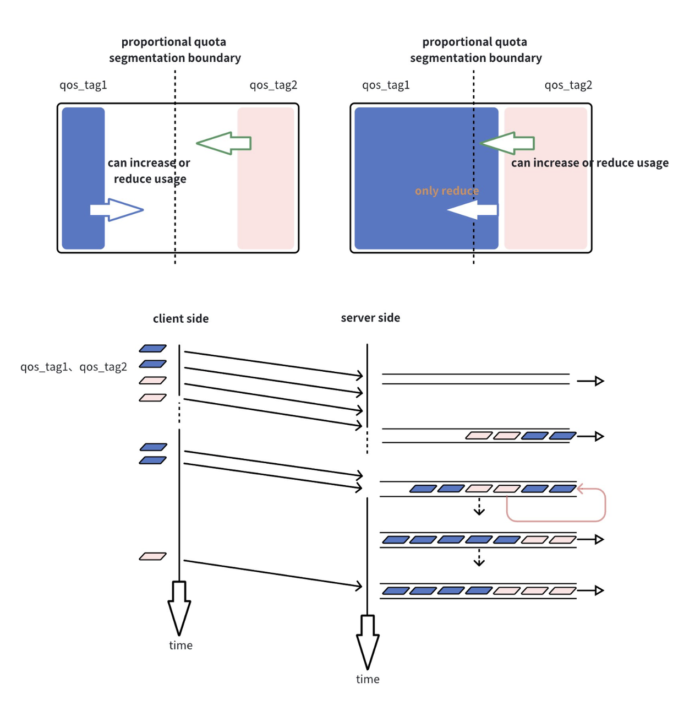
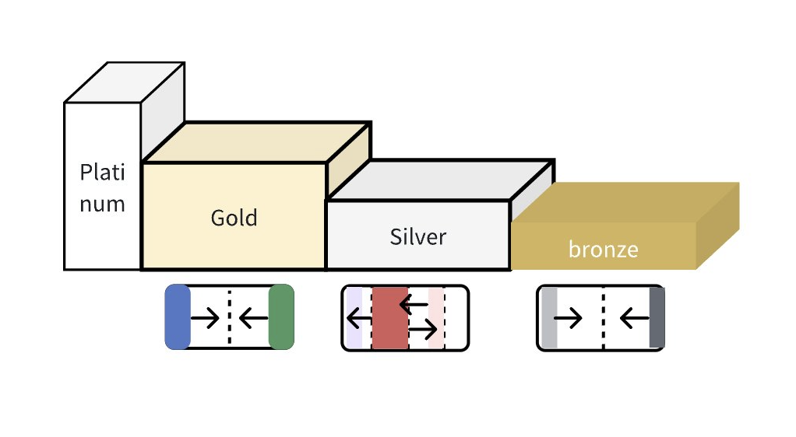

## Lmdeploy-QoS Introduce and Usage

### Background

Inference frameworks emerges along with the LLM and AGI for the past period time. We see many inference frameworks providing scalable and high performant services in serving online workloads with language models. The workload they are serving usually comes with multiple user groups and the workload pattern changes quickly in a short time. Because many inference frameworks struggle in meeting requirements of these multi-tenancy traffic patterns and doesn't well shape user's behaviors, we think considering this systematically in LLM inference framework world is valuable and necessary.

### User Categorizations for Multi-tenancy Handling

Lmdeploy-QoS comes along with Lmdeploy to provide a series of multi-tenancy functionality. It requires user to tag their inference requests with proper user identifications(user_id in config or codebase). It works based on a dictionary like configuration as the multi-tenancy policy. In this configuration, users are mapped to various classes called "user groups" and configured with a ratio value. Our multi-tenancy strategy reads the configuration and schedules user inference requests based on their class priority and the delta between predefined ratio and the realtime allocation ratio. With thorough tests, our Lmdeploy-QoS greatly improves the Llm serving reliability and the GPU resources utilizations for real world large language model inference workload. 

Lmdeploy categorized users into 4 groups:

- Platinum
- Gold
- Silver
- Bronze

Based on our particular experience in serving Llm services, we can map below described 4 types of users to these user groups:

- Platinum: vip users or admin users. Typical examples are service inspector or product demo presenter that requires uninterruptable online service. Their work load are in low frequency and low resource demand.

- Gold: business user groups with contracts that require measurable amount of reliable services. For example certain company A signed a contract with Llm service provider and bought X request/sec service ability with availability Z% for A's employees with a Y millions $ per year payment.

- Silver: vast majority of users. Most trial or monthly subscribed users are categorized into this group. They need relatively small amount of services but their user experiences are also important to Llm service reputation.

- Bronze: heavy users that pays very few to Llm providers.

The purpose of introducing the above user group categorizations is for instructions rather than recommendations for all Lmdeploy users because it's not necessarily the one suitable for any Llm business providers. The user can decide their own way of categorizing users based on their observations of daily workload. 

Below let's talk about how Lmdeploy schedules requests based on this categorizations.

### Multi-tenancy Strategies

#### Strategy 1: prioritized scheduling between groups

This strategy works as simple as its title. Requests with higher priority always have higher priority to be inferred. To be noted that because the scheduling action is performed at request receiving time, it won't retrospectively chase back requests with lower priority already under inference.

The below diagram shows how the prioritization works. As you can see platinum request was reprioritized and moved to queue head.



#### Strategy 2: proportionally rated scheduling with a pre-defined ratio within user group

This strategy works only within user group. We introduce a within group user quota configuration table. This table defines users' "ideal share ratio" with a sum value of 100% GPU resource. Each "user" appears in the list as a user_id, and a user can only belong to one user group. The term "ideal share" means when the system is full of requests defined in the configuration list in the pending requests, without anyone absent, the user will be schedule in a way that it appears taking the GPU "share" with an amount proportional to the ratio in the configuration. To be noted, if one or more user on the list is absent in the pending requests, the rest users shall be scheduled appeared as taking their share with ratios proportional to their corresponding configured value left among the list. 

To be noted, the share value configured on the table shall be reasonably large. As a contrary example, to allocate a 1% quota ratio for certain user may represent a ratio of GPU resource's granularity too-fined to serve a inference request, which could lead to starvation for this user.

The below diagram shows a typical example of how this strategy works.



#### Strategy 3: a combination strategy of 1 and 2

We can call it hybrid strategy. They way we hybrid these 2 strategies is fairly simple: we adopt the strategy 1 in between user groups, and adopt strategy 2 within a user group. So users with different groups having different priority will only obey strategy 1 to determine their priviledge in resource allocation. That said, when both strategies appears, the first strategy will overpower the second. When it comes to a situation that no cross group requests are in pending for serving, the within group strategy 2 comes to play.

Below is a diagram shows it.



To be noted, there could be other ways of hybridding strategy 1 &2, this doc only introduced one method that works well at our scenario. Other hybrid methods shall consider that the prioritization and pro-rated sharing are obviously conflicting strategies so there isn't easy way to mix them to work within a single dimension. 

That been said, there are ways to meet users' simple requirements to only make use either one of the strategy. For example, a system requires only fair-sharing like strategy can configure with every users under one group. A good example is one model deployed for two different business purposes without dependency; A system having need of strictly chained prioritizations between different group of users can configure with at most 4 groups and each group having only one user. A good example is DAG inference workload. 

### A Sample QoS Configuration

The configuration will be placed along with lmdeploy binary and be periodically loaded by program in runtime.

```json
{
    "enable_user_qos": true,
    "user_groups":{
        "Platinum",
        "Gold",
        "Silver",
        "Bronze"
    },
    "user_group_map": {
        "Platinum": [
            {
                "id": "user_id0",
                "quota_pct": "100"
            },
            {
                "id": "default",
                // No default for platinum
                "quota_pct": "0"
            }
        ],
        "Gold": [
            {
                "id": "user_id1",
                "quota_pct": "50"
            },
            {
                "id": "user_id2",
                "quota_pct": "50"
            }
        ],
        "Silver": [
            {
                "id": "user_id3",
                "quota_pct": "5"
            },
            {
                "id": "default",
                "quota_pct": "95"
            }
        ],
        "Bronze": [
            {
                "id": "user_id4",
                "quota_pct": "30"
            },
            {
                "id": "user_id5",
                "quota_pct": "30"
            },
            {
                "id": "user_id6",
                "quota_pct": "40"
            },
            {
                "id": "default",
                "quota_pct": "0"
            }
        ]
    }
}
```

### How to infer with Lmdeploy-QoS aware

We provide the code link below to show how to call infer request with multi-tenancy strategy awared.

@app.post('/v1/chat/interactive_qos'):

```python
'''
lmdeploy/serve/openai/api_server.py:420
- temperature (float): to modulate the next token probability
    - repetition_penalty (float): The parameter for repetition penalty.
        1.0 means no penalty
    - ignore_eos (bool): indicator for ignoring eos
    - user_id (str): for qos functionality; if not specified, will set to "default"
'''
```

@app.post('/v1/chat/completions_qos')

```python
'''
lmdeploy/serve/openai/api_server.py:110
Additional arguments supported by LMDeploy:
    - ignore_eos (bool): indicator for ignoring eos
    - session_id (int): if not specified, will set random value
    - user_id (str): for qos functionality; if not specified, will set to "default"
'''
```

@app.post('/v1/completions_qos')

```python
'''
lmdeploy/serve/openai/api_server.py:387
    Additional arguments supported by LMDeploy:
    - ignore_eos (bool): indicator for ignoring eos
    - session_id (int): if not specified, will set random value
    - user_id (str): for qos functionality; if not specified, will set to "default"
'''
```

What the qos related argument appear as in http body：

/v1/chat/interactive_qos

```bash
curl -X POST http://localhost/v1/chat/interactive_qos \
  -H "Content-Type: application/json" \
  -d '{
  "prompt": "Hello,Hello",
  "session_id": -1,
  "interactive_mode": false,
  "stream": false,
  "stop": false,
  "request_output_len": 512,
  "top_p": 0.8,
  "top_k": 40,
  "temperature": 0.8,
  "repetition_penalty": 1,
  "ignore_eos": false,
  "user_id": "default"
}'
```

/v1/chat/completions_qos

```bash
curl -X POST http://localhost/v1/chat/completions_qos \
  -H "Content-Type: application/json" \
  -d '{
  "model": "internlm-chat-7b",
  "messages": "Hello,Hello",
  "temperature": 0.7,
  "top_p": 1,
  "n": 1,
  "max_tokens": 512,
  "stop": false,
  "stream": false,
  "presence_penalty": 0,
  "frequency_penalty": 0,
  "repetition_penalty": 1,
  "session_id": -1,
  "ignore_eos": false,
  "user_id": "default"
}'
```

/v1/completions_qos

```bash
curl -X POST http://localhost/v1/completions_qos \
  -H "Content-Type: application/json" \
  -d '{
  "model": "internlm-chat-7b",
  "prompt": "Hello,Hello",
  "suffix": "string",
  "temperature": 0.7,
  "n": 1,
  "max_tokens": 16,
  "stop": "string",
  "stream": false,
  "top_p": 1,
  "repetition_penalty": 1,
  "session_id": -1,
  "ignore_eos": false,
  "user_id": "default"
}'
```

### File Configuration Modification

The configuration file modification involves adjusting settings within the file located at: `lmdeploy/server/qos_engine/qos_config.json`.

The content format should follow the guidelines provided in the `qos_config.json.template` file. Add the necessary configurations for users, ensuring correct priority assignment, and setting appropriate quota values.

### Passing Configuration Parameters

Upon starting the api_server, pass the configuration file and its path using the `--qos_config_path` flag. An example is illustrated below:

```bash
CUDA_VISIBLE_DEVICES=4 python main.py serve api_server ../../download/workspace/workspace/ --server_port 11454 --qos_config_path lmdeploy/serve/qos_engine/qos_config.json
```