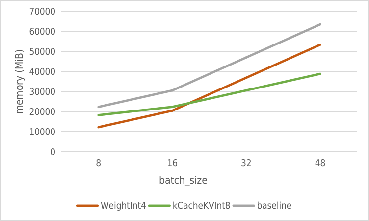

# KV Cache 量化和测试结果

对于最大长度是 2048 的 LLaMa-7B fp16 模型，服务端每创建 1 个并发，都需要大约 1030MB 显存保存 kv_cache，即便是 A100 80G，能服务的用户也非常有限。

为了降低运行时显存，我们实现了 kv cache PTQ 量化，使用的公式如下：

```bash
zp = (min+max) / 2
scale = (max-min) / 255
quant: q = round( (f-zp) / scale)
dequant: f = q * scale + zp
```

## 如何开启 KV Cache INT8

### **第一步**

把 huggingface 格式的模型，转成 turbomind 推理格式，得到一个 workspace 目录

```bash
python3 -m lmdeploy.serve.turbomind.deploy internlm-chat-7b /path/to/internlm-chat-7b
```

如果已经有 workspace 目录，可以跳过这步。

### **第二步**

通过以下 2 步，获取量化参数

```bash
# 计算 minmax
python3 -m lmdeploy.lite.apis.calibrate \
  --model $HF_MODEL \
  --calib_dataset 'c4' \             # 校准数据集，支持 c4, ptb, wikitext2, pileval
  --calib_samples 128 \              # 校准集的样本数，如果显存不够，可以适当调小
  --calib_seqlen 2048 \              # 单条的文本长度，如果显存不够，可以适当调小
  --work_dir $WORK_DIR \             # 保存 Pytorch 格式量化统计参数和量化后权重的文件夹

# 通过 minmax 获取量化参数
python3 -m lmdeploy.lite.apis.kv_qparams \
  --work_dir $WORK_DIR  \                             # 上一步的结果
  --turbomind_dir workspace/triton_models/weights/ \ # 保存量化参数的目录，推理要用
  --kv_sym False \                                    # 对称量化或非对称量化，默认为 False
  --num_tp 1  \                                       # Tensor 并行使用的 GPU 数，和 deploy.py 保持一致
```

`kv_qparams` 会在 `weights` 目录生成 fp32 缩放系数，文件格式是 `numpy.tofile` 产生的二进制。

也可以先把 `turbomind_dir` 设成私有目录，再把缩放系数拷贝进 `workspace/triton_models/weights/`。

### **第三步**

修改 `workspace/triton_models/weights/config.ini`：

- use_context_fmha 改为 0，表示关闭 flashattention
- quant_policy 设置为 4。表示打开 kv_cache int8

这是因为 flashattention 有 v1、v2 两个版本，kv cache int8 曾经也实现过对称版本。

排列组合需要实现 4 套 kernel，在算法不确定的时候过早优化，对软件来说是场灾难。

### **第四步**

测试聊天效果

```bash
python3 -m lmdeploy.turbomind.chat ./workspace
```

## 显存测试

测试对象为 [internlm-chat-7b](https://huggingface.co/internlm/internlm-chat-7b-v1_1) 模型。
测试方法：

1. 使用 `deploy.py` 转换模型，修改 `workspace` 配置中的最大并发数；调整 `llama_config.ini` 中的请求数
2. 编译执行 `bin/llama_triton_example`，获取 fp16 版本在不同 batch_size 的显存情况
3. 开启量化，重新执行 `bin/llama_triton_example`，获取 int8 版本在不同 batch_size 显存情况

以下是两个版本的显存对比：

| batch_size | fp16 memory(MiB) | int8 memory(MiB) | diff(MiB) |
| :--------: | :--------------: | :--------------: | :-------: |
|     8      |      22337       |      18241       |   -4096   |
|     16     |      30593       |      22369       |   -8224   |
|     32     |      47073       |      30625       |  -16448   |
|     48     |      63553       |      38881       |  -24672   |

相对于直接量化 Weight（如 [GPTQ-for-LLaMa](https://github.com/qwopqwop200/GPTQ-for-LLaMa/)），我们做了两种方案在 7B 模型中的内存增长对比预估，部分数据来自 [llama.cpp](https://github.com/ggerganov/llama.cpp)。



可以看到，fp16 版本每个并发需要 1030MB 显存，因此量化 kv_cache 能显著降低运行时的显存增长速度。

## 精度测试

测试对象为 [internlm-chat-7b](https://huggingface.co/internlm/internlm-chat-7b-v1_1) 指令模型。

以下是 `kCacheKVInt8` 方法仅从 c4 数据集，随机选择 128 条数据 PTQ 量化。量化前后均使用 [opencompass](https://github.com/InternLM/opencompass) 测试精度。

|     task      |     dataset     |    metric     | int8  | fp16  | diff  |
| :-----------: | :-------------: | :-----------: | :---: | :---: | :---: |
|   Language    |   winogrande    |   accuracy    | 60.77 | 61.48 | -0.71 |
|   Knowledge   |       nq        |     score     | 2.69  | 2.60  | +0.09 |
|   Reasoning   |      gsm8k      |   accuracy    | 33.28 | 34.72 | -1.44 |
|   Reasoning   |       bbh       | naive_average | 20.12 | 20.51 | -0.39 |
| Understanding | openbookqa_fact |   accuracy    | 82.40 | 82.20 | +0.20 |
| Understanding |   eprstmt-dev   |   accuracy    | 90.62 | 88.75 | +1.87 |
|    Safety     |   crows_pairs   |   accuracy    | 32.56 | 31.43 | +1.13 |

需要注意的是，`kCacheKVInt8` 和 `WeightInt4` 两种方案可以同时开启。
