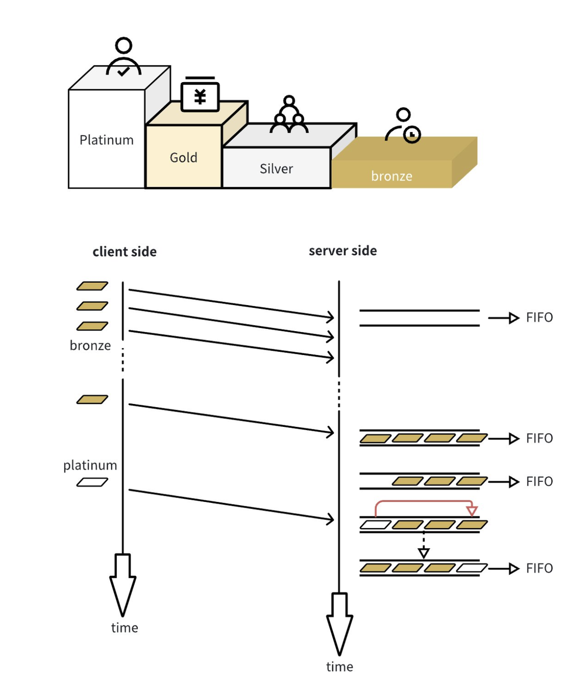
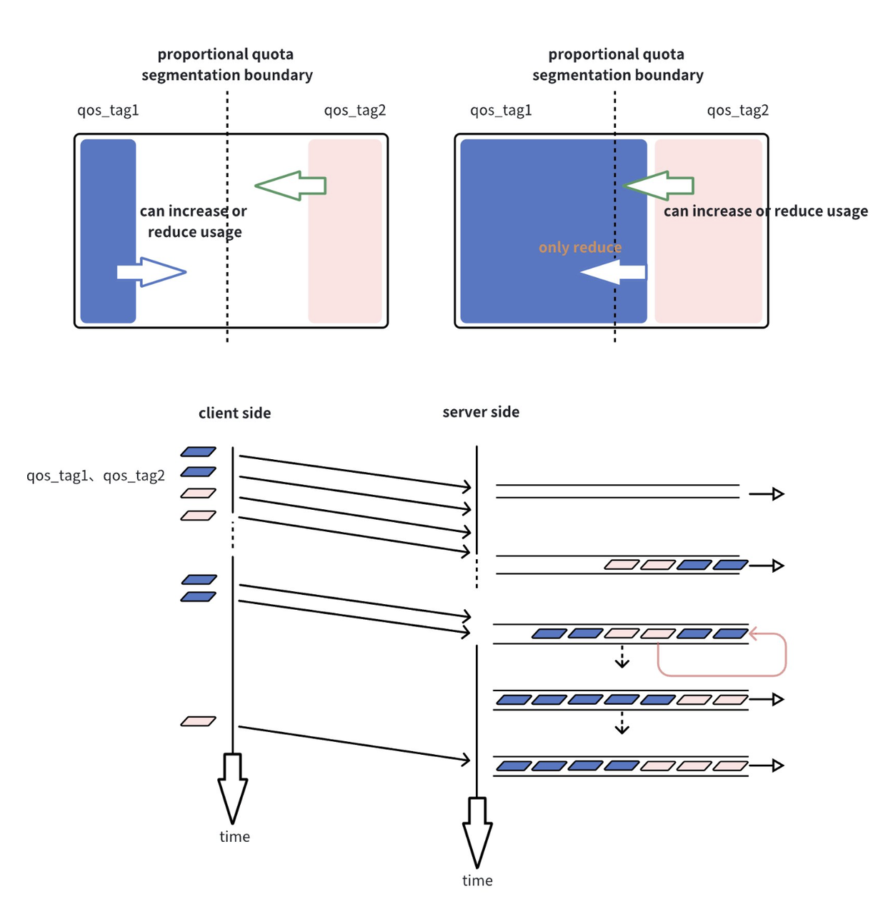
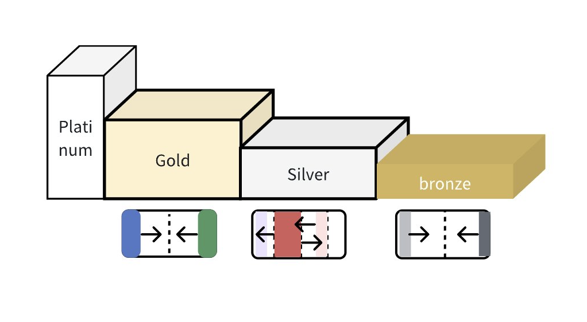

## Lmdeploy-QoS 介绍与用法
### 背景

推理框架伴随着LLM和AGI在过去一段时间内出现。我们看到许多推理框架为语言模型提供可扩展和高性能的在线工作负载服务。它们所服务的工作负载通常涉及多个用户群体，并且工作负载模式在短时间内快速变化。由于许多推理框架在满足这些多租户流量模式的要求方面存在困难，并且未能很好地塑造用户的行为，我们认为在LLM推理框架领域系统地考虑这一点是有价值且必要的。

### 多租户处理的用户分类

Lmdeploy-QoS与Lmdeploy一起提供一系列多租户功能。它要求用户使用适当的用户标识（配置文件或代码库中的user_id）标记其推理请求。它基于类似字典的配置作为多租户策略。在这个配置中，用户被映射到称为“用户组”的各种类别，并配置有一个比率值。我们的多租户策略读取配置，并根据其类别优先级和预定义比率与实时分配比率之间的差异安排用户推理请求的调度。经过彻底的测试，我们的Lmdeploy-QoS极大地提高了Llm的服务可靠性和用于实际世界大型语言模型推理工作负载的GPU资源利用率。

Lmdeploy将用户分为4组：

- 白金（Platinum）
- 金（Gold）
- 银（Silver）
- 青铜（Bronze）

根据我们在提供Llm服务方面的特定经验，我们可以将以下描述的4种类型的用户映射到这些用户组中：

- Platinum（白金）: VIP用户或管理员用户。典型例子包括需要不间断在线服务的服务检查员或产品演示员。他们的工作负载频率低，对资源需求也不高。

- Gold（金）: 具有合同的业务用户群体，需要可衡量的可靠服务。例如，某个公司A与Llm服务提供商签订了合同，购买了每秒X个请求的服务能力，可用性为Z%，供A公司员工使用，年付Y百万美元。

- Silver（银）: 绝大多数用户。大多数试用或每月订阅的用户被归类为此类别。他们需要相对较少的服务，但他们的用户体验对于Llm服务的声誉也很重要。

- Bronze（青铜）: 支付很少费用给Llm提供商的重度用户。

以上引入用户组分类的目的是为了提供指导，而不是为所有Lmdeploy用户提供建议，因为这并不一定适用于所有Llm业务提供商。用户可以根据他们对日常工作负载的观察，自行决定如何对用户进行分类。

接下来让我们讨论一下Lmdeploy如何根据这些分类安排请求。

### 多租户策略

#### 策略 1: 用户组之间的优先级调度


这种策略的工作原理与其标题一样简单。具有较高优先级的请求始终具有更高的推理优先级。需要注意的是，由于调度操作是在接收请求时执行的，它不会回溯地追溯到已经在推理中的低优先级请求。

下面的图表显示了优先级处理的工作原理。您可以看到白金请求已被重新设置优先级并移至队列头部。



#### 策略 2: 用户组内基于预定义比例的按比例调度

这个策略仅适用于用户组内部。我们引入了一个用户组内的用户配额配置表。该表定义了用户在 100% GPU 资源中的 "理想份额比例"。每个 "用户" 在列表中以用户 ID 的形式出现，并且一个用户只能属于一个用户组。术语 "理想份额" 意味着当系统中存在配置列表中定义的挂起请求时，没有任何人缺席，系统将安排用户以配置中比例成比例地占用 GPU "份额"。需要注意的是，如果列表中的一个或多个用户在挂起请求中缺席，剩下的用户将按照它们在列表中对应配置值之间的比例被安排占用份额。

需要注意的是，配置表中设置的份额值应该是相当大的。相反的情况是，为某个用户分配1%的配额比例可能代表了 GPU 资源粒度过于细致，无法服务于推断请求，这可能会导致该用户无法获得资源。

以下图表展示了这种策略的典型示例。



#### 策略3：1和2的组合策略

我们可以称之为混合策略。混合这两种策略的方式非常简单：我们在用户组之间采用策略1，在用户组内部采用策略2。因此，具有不同优先级的不同用户组将只遵循策略1来确定其在资源分配中的特权。换句话说，当两种策略同时出现时，第一种策略将压倒第二种。当没有跨组请求需要提供服务时，用户组内部的策略2就会发挥作用。

以下是显示这一点的图片。



需要注意的是，混合策略1和2可能有其他方法，本文档只介绍了一种在我们场景下有效的方法。其他混合方法需要考虑到优先级和按比例共享明显是相互冲突的策略，因此没有简单的方法将它们混合在单一维度内工作。

话虽如此，有办法满足用户简单要求，只使用这两种策略中的其中一种。例如，一个系统只需要像策略一样进行公平共享，可以将每个用户配置在同一用户组下。一个很好的例子是一个模型为两个不相互依赖的不同业务目的而部署；一个系统需要在不同用户组之间进行严格的串联优先级配置，可以最多配置4个用户组，每个用户组只有一个用户。一个很好的例子是DAG推理工作负载。

### 一个示例的QoS配置

配置将与lmdeploy二进制文件一起放置，并将由运行时程序定期加载。

```json
{
    "enable_user_qos": true,
    "user_groups":{
        "Platinum",
        "Gold",
        "Silver",
        "Bronze"
    },
    "user_group_map": {
        "Platinum": [
            {
                "id": "user_id0",
                "quota_pct": "100"
            },
            {
                "id": "default",
                // No default for platinum
                "quota_pct": "0"
            }
        ],
        "Gold": [
            {
                "id": "user_id1",
                "quota_pct": "50"
            },
            {
                "id": "user_id2",
                "quota_pct": "50"
            }
        ],
        "Silver": [
            {
                "id": "user_id3",
                "quota_pct": "5"
            },
            {
                "id": "default",
                "quota_pct": "95"
            }
        ],
        "Bronze": [
            {
                "id": "user_id4",
                "quota_pct": "30"
            },
            {
                "id": "user_id5",
                "quota_pct": "30"
            },
            {
                "id": "user_id6",
                "quota_pct": "40"
            },
            {
                "id": "default",
                "quota_pct": "0"
            }
        ]
    }
}
```

### 如何使用 Lmdeploy-QoS 感知进行推理

我们提供以下代码链接，展示如何调用具有多租户策略感知的推理请求。

@app.post('/v1/chat/interactive_qos'):

```python
'''
lmdeploy/serve/openai/api_server.py:420
- temperature (float): to modulate the next token probability
    - repetition_penalty (float): The parameter for repetition penalty.
        1.0 means no penalty
    - ignore_eos (bool): indicator for ignoring eos
    - user_id (str): for qos functionality; if not specified, will set to "default"
'''
```

@app.post('/v1/chat/completions_qos')

```python
'''
lmdeploy/serve/openai/api_server.py:110
Additional arguments supported by LMDeploy:
    - ignore_eos (bool): indicator for ignoring eos
    - session_id (int): if not specified, will set random value
    - user_id (str): for qos functionality; if not specified, will set to "default"
'''
```

@app.post('/v1/completions_qos')

```python
'''
lmdeploy/serve/openai/api_server.py:387
    Additional arguments supported by LMDeploy:
    - ignore_eos (bool): indicator for ignoring eos
    - session_id (int): if not specified, will set random value
    - user_id (str): for qos functionality; if not specified, will set to "default"
'''
```

在 HTTP 主体中，与 QoS 相关的参数如下：

/v1/chat/interactive_qos

```bash
curl -X POST http://localhost/v1/chat/interactive_qos \
  -H "Content-Type: application/json" \
  -d '{
  "prompt": "Hello,Hello",
  "session_id": -1,
  "interactive_mode": false,
  "stream": false,
  "stop": false,
  "request_output_len": 512,
  "top_p": 0.8,
  "top_k": 40,
  "temperature": 0.8,
  "repetition_penalty": 1,
  "ignore_eos": false,
  "user_id": "default"
}'
```

/v1/chat/completions_qos

```bash
curl -X POST http://localhost/v1/chat/completions_qos \
  -H "Content-Type: application/json" \
  -d '{
  "model": "internlm-chat-7b",
  "messages": "Hello,Hello",
  "temperature": 0.7,
  "top_p": 1,
  "n": 1,
  "max_tokens": 512,
  "stop": false,
  "stream": false,
  "presence_penalty": 0,
  "frequency_penalty": 0,
  "repetition_penalty": 1,
  "session_id": -1,
  "ignore_eos": false,
  "user_id": "default"
}'
```

/v1/completions_qos

```bash
curl -X POST http://localhost/v1/completions_qos \
  -H "Content-Type: application/json" \
  -d '{
  "model": "internlm-chat-7b",
  "prompt": "Hello,Hello",
  "suffix": "string",
  "temperature": 0.7,
  "n": 1,
  "max_tokens": 16,
  "stop": "string",
  "stream": false,
  "top_p": 1,
  "repetition_penalty": 1,
  "session_id": -1,
  "ignore_eos": false,
  "user_id": "default"
}'
```

### 配置文件修改

配置文件路径为：`lmdeploy/server/qos_engine/qos_config.json`

内容格式参考`qos_config.json.template`文件，添加需要配置的用户，设置正确的优先级以及quota值。

### 配置参数传入
启动api_server时，通过`--qos_config_path`，将配置文件及路径传入，示例如下：

```bash
CUDA_VISIBLE_DEVICES=4 python main.py serve api_server ../../download/workspace/workspace/ --server_port 11454 --qos_config_path lmdeploy/serve/qos_engine/qos_config.json
```