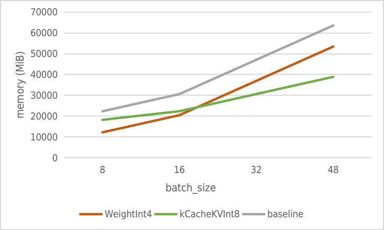

# PTQ 量化测试结果

## 显存占用测试

测试对象为 [Chinese-LLaMa-Alpaca 7B](https://github.com/ymcui/Chinese-LLaMA-Alpaca) 指令模型。
测试方法：

1. 使用 `deploy.py` 转换模型，修改 `workspace` 配置中的最大并发数，调整 `llama_config.ini` 中的请求数；
2. 编译执行 `bin/llama_triton_example`，获取 fp16 版本在不同 batch_size 的显存占用情况；
3. 执行量化脚本，获取量化参数后修改配置文件，使 [kCacheKVInt8](../../src/turbomind/models/llama/llama_utils.h) 选项生效；
4. 重新执行 `bin/llama_triton_example`，获取 int8 版本在不同 batch_size 显存占用情况。

以下是两个版本的显存使用对比：

| batch_size | fp16 memory(MiB) | int8 memory(MiB) | diff(MiB) |
| :--------: | :--------------: | :--------------: | :-------: |
|     8      |      22337       |      18241       |   -4096   |
|     16     |      30593       |      22369       |   -8224   |
|     32     |      47073       |      30625       |  -16448   |
|     48     |      63553       |      38881       |  -24672   |

相对于直接量化 Weight 的方法（如 [GPTQ-for-LLaMa](https://github.com/qwopqwop200/GPTQ-for-LLaMa/)），我们做了对两种方案在 7B 模型中的内存增长的对比预估，部分数据来自 [llama.cpp](https://github.com/ggerganov/llama.cpp)。

因为每个并发需要 1030MB 的显存来为 2048 大小的 token 保存对应的 kv_cache，而服务端需要考量高并发场景的成本，所以量化 kv_cache 比直接量化 weight 更合适。

需要注意的是，`kCacheKVInt8` 和 `WeightInt4` 两种方案可以同时运行，我们后续将提供相关实现。

## 精度测试

测试对象为 [Chinese-LLaMa-Alpaca 7B](https://github.com/ymcui/Chinese-LLaMA-Alpaca) 指令模型。
测试方法：

1. 用 `deploy.py` 转换模型，运行 docker 服务；
2. 通过 `client.py` 测试数据集，获取 fp16 版本精度；
3. 执行量化脚本，得到量化参数，放到 weights 目录后修改配置文件，使 [kCacheKVInt8](../../src/turbomind/models/llama/llama_utils.h) 选项生效；
4. 再次执行 `client.py`，读取 int8 版本精度。

以下是 `kCacheKVInt8` 方法用从 c4 数据集中随机选择的 128 条数据量化后，在 mmlu-social-science 数据集测试得到的的精度损失，mmlu-social-science 一共有 3065 个选择题。

| task |       dataset       | metric | fp16  | int8  | diff  |
| :--: | :-----------------: | :----: | :---: | :---: | :---: |
| Exam | mmlu-social-science | score  | 31.81 | 32.00 | +0.19 |

我们注意到量化后精度有轻微提升，两个版本的具体差异如下：

|             类型             | 个数 |
| :--------------------------: | :--: |
| fp16 版回答错误，int8 版变对 |  72  |
| fp16 版回答正确，int8 版变错 |  66  |
|     两版均答错且答案不同     | 118  |

我们已经在更大的模型上验证了更多数据集，将持续更新结果。
