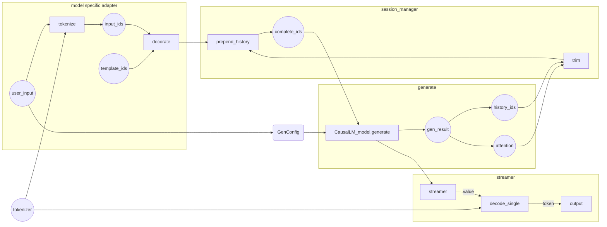

# Simple diagram of components

```mermaid
graph LR;
    subgraph model specific adapter
        p((user_input))-->tokenize-->id((input_ids))-->decorate
        tmpl_ids((template_ids))-->decorate;
    end
    subgraph generate
        model[CausalLM_model.generate]-->gen_result(("gen_result"))
        gen_result-->hid
        gen_result-->attn((attention))
    end
    subgraph streamer
        model-->s[streamer]--value-->decode_single--token-->output
    end
    subgraph session_manager
        prepend_history-->fullid((complete_ids));
        trim-->prepend_history
    end
    decorate-->prepend_history
    hid((history_ids))-->trim;
    attn-->trim;
    fullid-->model
    tokenizer((tokenizer))-->decode_single
    tokenizer-->tokenize
    p-->genconfig(GenConfig)-->model
```
